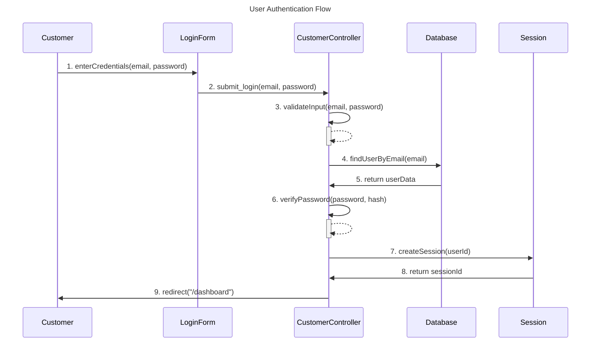
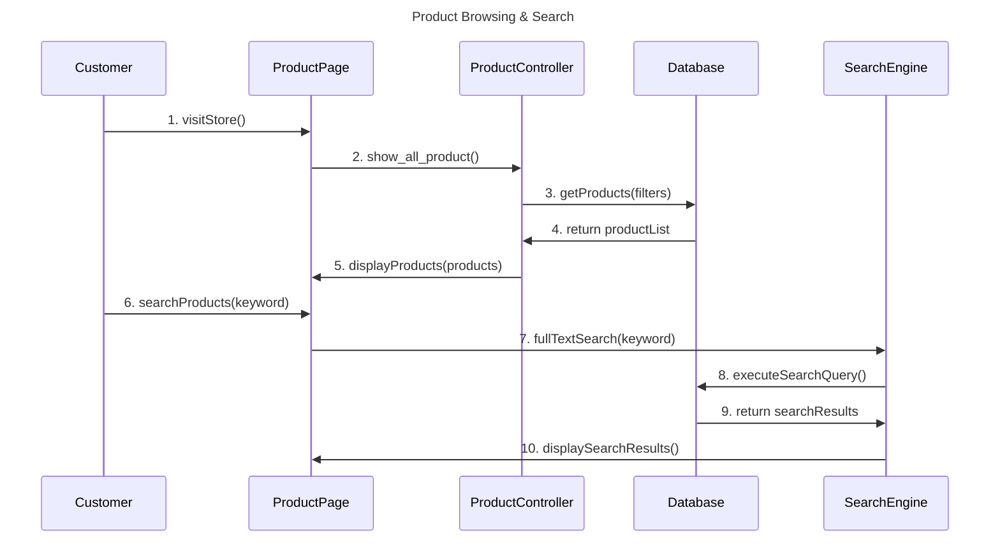
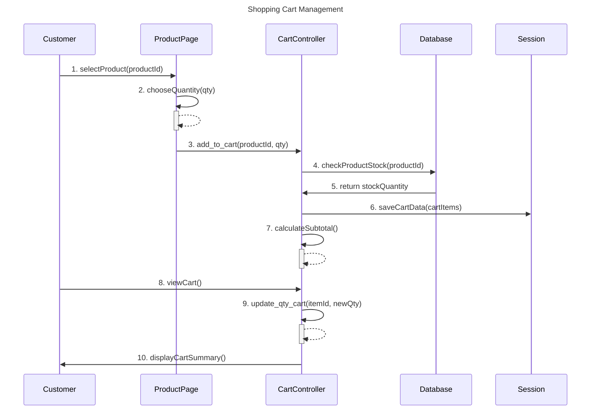
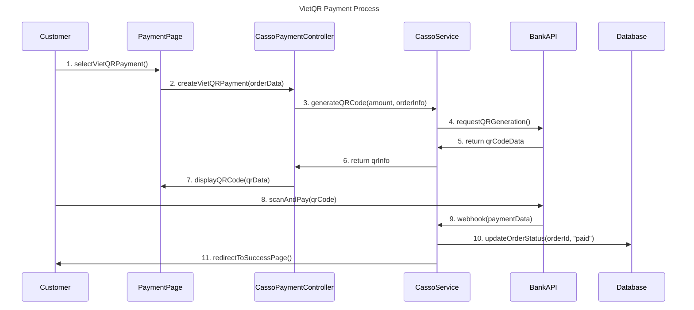
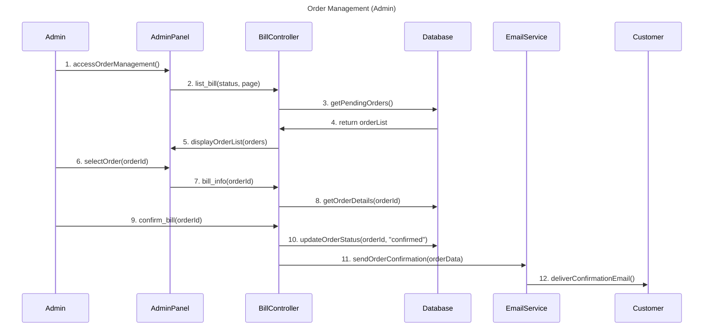
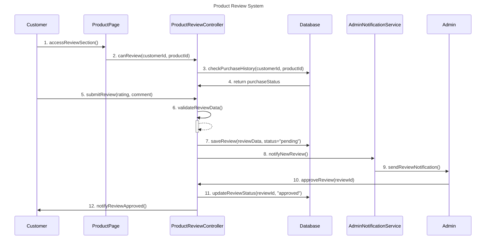
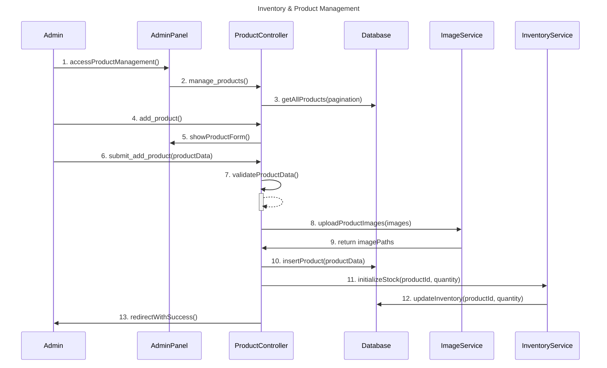

# 7 MAIN SEQUENCE DIAGRAMS - ERICSHOP E-COMMERCE

Generated: 2025-09-24 10:43:08

## Overview
This document contains 7 main sequence diagrams for EricShop e-commerce system.
Each diagram focuses on core business functions with clear method names.

## 1. User Authentication Flow

**Actors:** Customer, LoginForm, CustomerController, Database, Session
**Steps:** 9

### Mermaid Code:

### Step-by-step:
1. **Customer** → **LoginForm**: `enterCredentials(email, password)`
2. **LoginForm** → **CustomerController**: `submit_login(email, password)`
3. **CustomerController** → **CustomerController**: `validateInput(email, password)`
4. **CustomerController** → **Database**: `findUserByEmail(email)`
5. **Database** → **CustomerController**: `return userData`
6. **CustomerController** → **CustomerController**: `verifyPassword(password, hash)`
7. **CustomerController** → **Session**: `createSession(userId)`
8. **Session** → **CustomerController**: `return sessionId`
9. **CustomerController** → **Customer**: `redirect("/dashboard")`

---

## 2. Product Browsing & Search

**Actors:** Customer, ProductPage, ProductController, Database, SearchEngine
**Steps:** 10

### Mermaid Code:

### Step-by-step:
1. **Customer** → **ProductPage**: `visitStore()`
2. **ProductPage** → **ProductController**: `show_all_product()`
3. **ProductController** → **Database**: `getProducts(filters)`
4. **Database** → **ProductController**: `return productList`
5. **ProductController** → **ProductPage**: `displayProducts(products)`
6. **Customer** → **ProductPage**: `searchProducts(keyword)`
7. **ProductPage** → **SearchEngine**: `fullTextSearch(keyword)`
8. **SearchEngine** → **Database**: `executeSearchQuery()`
9. **Database** → **SearchEngine**: `return searchResults`
10. **SearchEngine** → **ProductPage**: `displaySearchResults()`

---

## 3. Shopping Cart Management

**Actors:** Customer, ProductPage, CartController, Database, Session
**Steps:** 10

### Mermaid Code:

### Step-by-step:
1. **Customer** → **ProductPage**: `selectProduct(productId)`
2. **ProductPage** → **ProductPage**: `chooseQuantity(qty)`
3. **ProductPage** → **CartController**: `add_to_cart(productId, qty)`
4. **CartController** → **Database**: `checkProductStock(productId)`
5. **Database** → **CartController**: `return stockQuantity`
6. **CartController** → **Session**: `saveCartData(cartItems)`
7. **CartController** → **CartController**: `calculateSubtotal()`
8. **Customer** → **CartController**: `viewCart()`
9. **CartController** → **CartController**: `update_qty_cart(itemId, newQty)`
10. **CartController** → **Customer**: `displayCartSummary()`

---

## 4. VietQR Payment Process

**Actors:** Customer, PaymentPage, CassoPaymentController, CassoService, BankAPI, Database
**Steps:** 11

### Mermaid Code:

### Step-by-step:
1. **Customer** → **PaymentPage**: `selectVietQRPayment()`
2. **PaymentPage** → **CassoPaymentController**: `createVietQRPayment(orderData)`
3. **CassoPaymentController** → **CassoService**: `generateQRCode(amount, orderInfo)`
4. **CassoService** → **BankAPI**: `requestQRGeneration()`
5. **BankAPI** → **CassoService**: `return qrCodeData`
6. **CassoService** → **CassoPaymentController**: `return qrInfo`
7. **CassoPaymentController** → **PaymentPage**: `displayQRCode(qrData)`
8. **Customer** → **BankAPI**: `scanAndPay(qrCode)`
9. **BankAPI** → **CassoService**: `webhook(paymentData)`
10. **CassoService** → **Database**: `updateOrderStatus(orderId, "paid")`
11. **CassoService** → **Customer**: `redirectToSuccessPage()`

---

## 5. Order Management (Admin)

**Actors:** Admin, AdminPanel, BillController, Database, EmailService, Customer
**Steps:** 12

### Mermaid Code:

### Step-by-step:
1. **Admin** → **AdminPanel**: `accessOrderManagement()`
2. **AdminPanel** → **BillController**: `list_bill(status, page)`
3. **BillController** → **Database**: `getPendingOrders()`
4. **Database** → **BillController**: `return orderList`
5. **BillController** → **AdminPanel**: `displayOrderList(orders)`
6. **Admin** → **AdminPanel**: `selectOrder(orderId)`
7. **AdminPanel** → **BillController**: `bill_info(orderId)`
8. **BillController** → **Database**: `getOrderDetails(orderId)`
9. **Admin** → **BillController**: `confirm_bill(orderId)`
10. **BillController** → **Database**: `updateOrderStatus(orderId, "confirmed")`
11. **BillController** → **EmailService**: `sendOrderConfirmation(orderData)`
12. **EmailService** → **Customer**: `deliverConfirmationEmail()`

---

## 6. Product Review System

**Actors:** Customer, ProductPage, ProductReviewController, Database, AdminNotificationService, Admin
**Steps:** 12

### Mermaid Code:

### Step-by-step:
1. **Customer** → **ProductPage**: `accessReviewSection()`
2. **ProductPage** → **ProductReviewController**: `canReview(customerId, productId)`
3. **ProductReviewController** → **Database**: `checkPurchaseHistory(customerId, productId)`
4. **Database** → **ProductReviewController**: `return purchaseStatus`
5. **Customer** → **ProductReviewController**: `submitReview(rating, comment)`
6. **ProductReviewController** → **ProductReviewController**: `validateReviewData()`
7. **ProductReviewController** → **Database**: `saveReview(reviewData, status="pending")`
8. **ProductReviewController** → **AdminNotificationService**: `notifyNewReview()`
9. **AdminNotificationService** → **Admin**: `sendReviewNotification()`
10. **Admin** → **ProductReviewController**: `approveReview(reviewId)`
11. **ProductReviewController** → **Database**: `updateReviewStatus(reviewId, "approved")`
12. **ProductReviewController** → **Customer**: `notifyReviewApproved()`

---

## 7. Inventory & Product Management

**Actors:** Admin, AdminPanel, ProductController, Database, ImageService, InventoryService
**Steps:** 13

### Mermaid Code:

### Step-by-step:
1. **Admin** → **AdminPanel**: `accessProductManagement()`
2. **AdminPanel** → **ProductController**: `manage_products()`
3. **ProductController** → **Database**: `getAllProducts(pagination)`
4. **Admin** → **ProductController**: `add_product()`
5. **ProductController** → **AdminPanel**: `showProductForm()`
6. **Admin** → **ProductController**: `submit_add_product(productData)`
7. **ProductController** → **ProductController**: `validateProductData()`
8. **ProductController** → **ImageService**: `uploadProductImages(images)`
9. **ImageService** → **ProductController**: `return imagePaths`
10. **ProductController** → **Database**: `insertProduct(productData)`
11. **ProductController** → **InventoryService**: `initializeStock(productId, quantity)`
12. **InventoryService** → **Database**: `updateInventory(productId, quantity)`
13. **ProductController** → **Admin**: `redirectWithSuccess()`

---

## Usage Instructions

### Method 1: Mermaid Live Editor
1. Visit: https://mermaid.live/
2. Copy any mermaid code block above
3. Paste in the editor
4. View and export diagram

### Method 2: Individual Files
- Use individual `main_sequence_*.txt` files
- Each file contains one diagram
- Import to draw.io or other tools

### Method 3: VS Code with Mermaid Extension
1. Install Mermaid Preview extension
2. Create .md file with mermaid code blocks
3. Preview in VS Code

